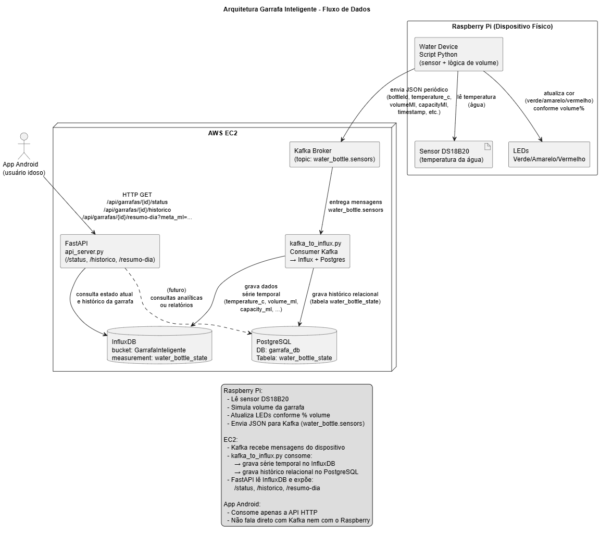

# Garrafa de Água Inteligente

Este repositório contém o projeto desenvolvido para a disciplina de Computação Ubíqua, cujo objetivo é simular uma garrafa de água inteligente voltada para o acompanhamento do consumo hídrico de, principalmente, idosos.

A ideia central é monitorar continuamente o estado da garrafa (volume de água e temperatura) por meio de sensores conectados a um Raspberry Pi, enviar esses dados para a nuvem e disponibilizá-los para aplicações clientes (como um app Android) por meio de uma API.

## Integrantes

1. Guilherme G.
2. Guilherme S.
3. Yure G.

## Objetivo do Trabalho

- Simular uma garrafa de água inteligente para auxiliar **idosos** a manterem uma ingestão adequada de água.
- Monitorar:
  - **Temperatura da água** (sensor DS18B20);
  - **Volume da garrafa** (simulado, com base em capacidade e “consumo” ao longo do tempo).
- Expor informações consolidadas (estado atual, histórico e resumo diário de consumo) por meio de uma **API REST**.
- Integrar camadas de **dispositivo físico**, **gêmeo digital** (dados na nuvem) e **aplicações cliente**.

## Tecnologias Utilizadas

- **Raspberry Pi**

  - Leitura do sensor DS18B20 (temperatura da água);
  - Simulação de volume de água;
  - Controle de **LEDs** (verde, amarelo, vermelho) para indicar o nível da garrafa.

- **Mensageria**

  - **Apache Kafka** para envio das leituras do dispositivo (JSON) para a nuvem.

- **Persistência de Dados**

  - **InfluxDB** para armazenamento de séries temporais (telemetria da garrafa);
  - **PostgreSQL** para armazenamento relacional/histórico das leituras.

- **Backend / API**

  - **Python** com **FastAPI** para exposição de endpoints:
    - `/api/garrafas/{id}/status`
    - `/api/garrafas/{id}/historico`
    - `/api/garrafas/{id}/resumo-dia`

- **Infraestrutura**
  - **AWS EC2** hospedando Kafka, InfluxDB, PostgreSQL e API;
  - **Docker** para subir o PostgreSQL e (opcionalmente) outros serviços.

## Arquitetura

A arquitetura geral da solução (do sensor até a API consumida pelo aplicativo) está representada no diagrama abaixo:

